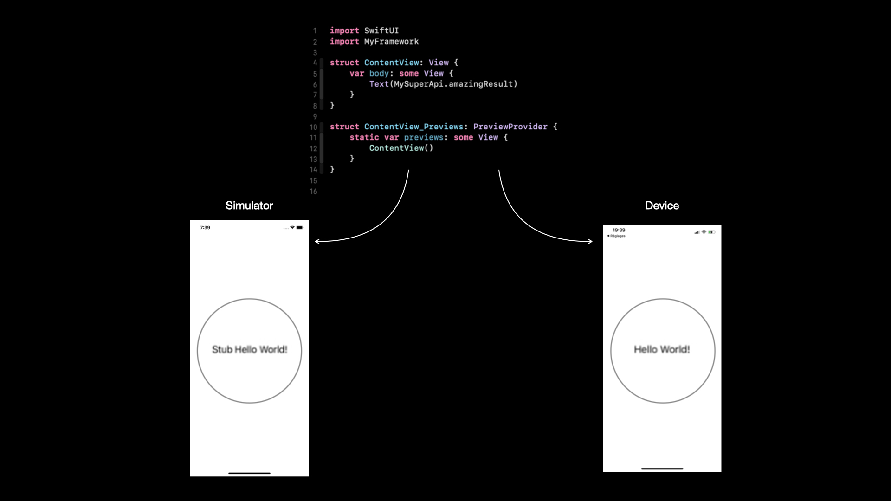

# Create mirror version of framework that does not support simulator

## Context
This project demonstrates how to create fake version of an existing SDK for a specific architecture.

Frequently manufacturers do not support version of their SDK for simulator. This is even more frequent now with Apple Silicon chip for Macs. It's possible to create stub version that mimic the behaviour of the SDK on simulator with stub values for their public API.

## How to use
1. Run `./generate-xcframework.sh`
2. Launch `SampleApp` on simulator and on device

Result 👇  
 

 
As you can see for a same source code XCode will automatically embed the right architecture framework to use based on what is in the XCFramework. 